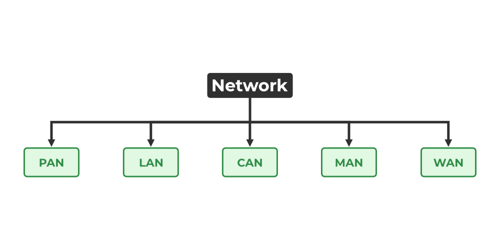
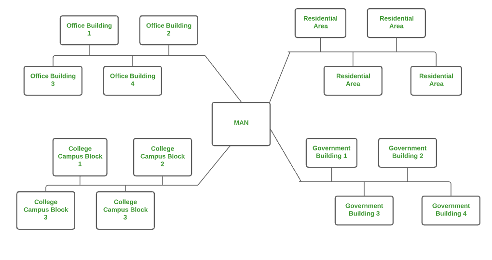
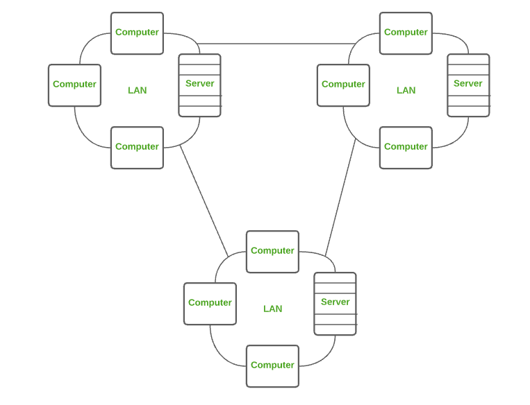
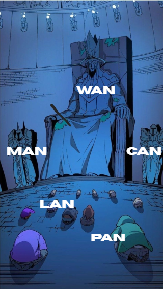

# Crimping & Routing IPv4
## Daftar Isi
- 1 Dasar Jaringan Protokol
    - Kenapa Komputer Harus Terhubung ke Jaringan
    - Jenis-Jenis Jaringan
    - Jaringan Komputer Punya Aturan?
    - Semua Komputer Memiliki Alamat
- 2 Masuk ke IP Address
- 3 Masuk ke IPv4
- 4 Kenektivitas Kabel LAN
    - Crimpring
    - Routing Menggunakan Router
        - Statis
        - Dinamis
## 1 Dasar Jaringan Protokol
Apa Itu Jaringan Komputer?
"Bayangkan kamu tinggal di sebuah komplek perumahan. Tiap rumah punya keluarga yang ingin saling ngobrol, kirim surat, atau pinjam gula. Nah, kalau mereka saling terkoneksi, itu disebut jaringan."

Jaringan komputer adalah kumpulan perangkat (seperti laptop, PC, printer, dan router) yang terhubung satu sama lain untuk berbagi informasi atau sumber daya.

Pengandaian:
Rumah = Komputer

Jalan di antara rumah = Kabel jaringan

Surat yang dikirim antar rumah = Data

Tukang pos = Router

Tetangga ngobrol langsung = LAN (Local Area Network)

Tetangga beda kampung ngobrol = WAN (Wide Area Network)

### 1.1 Kenapa Komputer Harus Terhubung ke Jaringan
Bayangkan kamu ingin mengirim file dari satu komputer ke komputer lain **tanpa jaringan**, kamu harus meng-copy file tersebut ke flashdisk terlebih dahulu. Lalu mencabut dan mencolokkannya ke komputer tujuan. 

[Gambar meme nggak sih]

Bisa dibayangkan proses manual tersebut memakan waktu dan memiliki keterbatasan jarak. Bahkan risiko kerusakan atau kehilangan data. Namun, dengan pemanfaatan **jaringan** pengiriman file tidak perlu mengandalkan alat eksternal seperti flashdisk. Selain itu pemindahan file dapat dalam hitungan detik dan tanpa kamu berpindah tempat.

Jadi kids koneksi jaringan bukan sebagai kebutuhan tambahan aja, no no no. Karena tanpa jaringan kemampuan komputer menjadi terbatas.

### 1.2 Jenis-Jenis Jaringan

Untuk informasi lebih rinci dapat dilihat di:
[Jenis-Jenis Jaringan](https://www.geeksforgeeks.org/types-of-computer-networks/)

#### 1.2.1 Personal Area Network (PAN)

**PAN** atau *Personal Area Network* ibarat jaringan kecil yang hanya mengelilingi satu orang. PAN ini khusus buat menghubungkan perangkat pribadi kamu yang jaraknya deket-deket, sekitar 1-100 meter.

Contohnya smartphone, laptop, smartwatch, bahkan printer yang kamu pakai sendiri bosa saling terhubung lewat jaringan ini.

**Fungsi PAN pada kehidupan sehari-hari:**
- Transfer file dari HP ke laptop lewat Bluethooh.
- Ngeprint dokumen dari laptop ke printer via USB

PAN ada 2 jenis:
- Wireless PAN: Nggak usah pakai kabel, dalam penerapannya memanfaatkan Bluetooth, WiFi, atau Zigbee. Contohnya kalau kamu lagi dengerin lagu pakai wireless headset dari HP kamu.
- Wired PAN: Pakai kabel, misalnya USB. Contohnya ketika kamu nyambungin HP ke laptop buat ngecas sekaligus sekaligus kirim file.

| ✅ **Kelebihan PAN**                                   | ❌ **Kekurangan PAN**                                                        |
|--------------------------------------------------------|-------------------------------------------------------------------------------|
| Praktis & fleksibel banget buat pemakaian pribadi      | Jangkauannya kecil, cuma buat sekitar 1 orang                                 |
| Biayanya murah dan gampang disetting                   | Kecepatan transfer data bisa terbatas, tergantung teknologinya                |
| Nggak perlu teknisi buat instalasi                     | Kadang perangkat nggak semua kompatibel satu sama lain                        |
| Mudah dibawa kemana-mana alias portable                | Beberapa teknologi PAN (kayak Zigbee) bisa agak mahal                         |
| Cocok buat orang yang pengen simple                    |                                                                       
#### 1.2.2 Local Area Network (LAN)

**LAN** atau *Local Area Network* adalah jenis jaringan komputer yang paling sering dipakai, terutama di tempat-tempat yang areanya terbatas, kayak di rumah, kator, sekolah, atau lab. Jarak jangkauan LAN maksimal 2 km dengan kecepatan transfer yang tinggi.

Jaringan ini menghubungkan **dua atau lebih** komputer dalam satu area lokal, pengaplikasian lewat kabel Ethernet atau Wi-Fi. Jika melalui Ethernet berarti menggunakan kabel LAN dan pengaplikasiannya dicolok ke switch atau router. Kalau pakai Wi-Fi nggak perlu pakek kabel dan pengaplukasiannya tinggal menggunakan hotspot

[Masukin meme bang :)]

Contohnya komputer di lab MIOT yang bisa diakses bersama atau semua komputer kantor yang bisa mengirim file satu sama lain.

| Kelebihan                 | Kekurangan                                                                 |
|-------------------------  |----------------------------------------------------------------------------|
| **Privasi Terjaga:** LAN bersifat privat, jadi tidak diatur oleh badan eksternal tertentu           | **Biaya Awal Lumayan:** Butuh perangkat tambahan seperti switch, router, dan software server      |
| **Kecepatan Tinggi:** Bisa mencapai 100 Mbps atau lebih, cocok buat transfer file besar         | **Privasi Bisa Terganggu:** Admin jaringan bisa akses file pribadi dan history internet kamu          |
| **Banyak Media Transmisi:** Bisa pakai kabel UTP, fiber optic, bahkan Wi-Fi   | **Jangkauan Terbatas:** Hanya berlaku untuk area lokal, tidak cocok untuk area yang terlalu luas                           |
| **Murah & Gampang Dipasang:** Instalasi, perawatan, dan pengembangannya relatif murah & simpel | **Risiko Keamanan Data:** Kalau server utama diretas, semua data di jaringan bisa bocor           |
| **Fleksibel & Scalable:** Bisa ditambah komputer atau perangkat lain dengan mudah     |                     |

#### 1.2.3 Campus Area Network (CAN)

**CAN** atau *Campus Area Network* adalah jaringan komputer yang ukurannya **lebih besar dari LAN**, tetapi masih **lebih kecil dari MAN**. CAN biasanya digunakan di sekolah, kampus, ataupun beberapa gedung dalam satu kompleks. Jarak konektivitas CAN 1 - 5 km.

Jadi bisa kamu bayangkan di TW2 ada lab MIOT, lab Robotik, ruang kelas di lantai 6, dan sekretariat di lantai 2 yang dihubungkan dalam satu jaringan—itulah CAN! Paham Ente ? 👊🏻

Teknologi CAN sama dengan LAN yang menggunakan Ethernet dan jika Wi-Fi.

| ✅ Kelebihan                                                          | ❌ Kekurangan                                                                 |
|-----------------------------------------------------------------------|--------------------------------------------------------------------------------|
| **Kecepatan**: Transfer data antarsistem lebih cepat karena menggunakan LAN, bukan internet umum.      | **Jangkauan Terbatas**: Tidak cocok untuk koneksi antar kota atau wilayah yang sangat luas. |
| **Keamanan**: Admin jaringan bisa mengatur akses dan menjaga jaringan dengan firewall.                | **Butuh Admin Tetap**: Diperlukan admin khusus agar jaringan tetap stabil dan aman.         |
| **Efisien Biaya**: Setup dan perawatan sedang, bisa pakai WiFi untuk menghemat kabel.                | **Bisa Overload**: Jika terlalu banyak pengguna aktif dan tidak diatur dengan baik.           |

#### 1.2.4 Metropolitan Area Network (MAN)

**MAN** atau *Metropolitan Area Network* adalah jaringan komputer yang ukurannya **lebih besar dari CAN**, tapi masih **lebih kecil dari WAN**. Jaringan ini digunakan untuk menghubungkan komputer-komputer dalam satu kota dengan jarak efektivitas 5-50 km.

Teknologi dibalik MAN ada **FDDI** atau *Fiber Distributed Data Interface*, **CDDI** atau *Copper Distributed Data Interface*, **ATM** atau *Asynchronous Transfer Mode*. Kecepatan MAN sekitar 10-100 Mbps.

**Contoh penerapannya:**
- Jaringan antar kampus dalam satu kota.
- Koneksi antar gedung perkontoran pemerintah.
- Sistem tiket atau informasi transportasi kota.
- Jaringan rumah sakit dan klinik dalam area kota.

| ✅ Kelebihan                                           | ❌ Kekurangan                                                                                  |
|--------------------------------------------------------|------------------------------------------------------------------------------------------------|
| **Koneksi Cepat:** Walaupun luas jangkauannya besar, MAN masih bisa memberikan kecepatan 10–100 Mbps.| **Struktur Kompleks:** Desain dan instalasinya cukup rumit, perlu perencanaan dan teknisi ahli.   |
| **Tingkat Keamanan Tinggi:** Lebih aman dibandingkan WAN karena lebih dikontrol dan terbatas.        | **Biaya Mahal:** Karena sering pakai fiber optic dan perangkat mahal, biaya awalnya cukup tinggi. |
| **Transfer Dua Arah (Simultan):** Berkat arsitektur dual bus, bisa kirim data dua arah sekaligus.    | **Toleransi Error Rendah:** Kalau ada masalah di satu titik jaringan, bisa berpengaruh besar.     |
| **Mendukung Banyak Pengguna Sekaligus:** Cocok untuk institusi besar yang butuh koneksi cepat bareng.| **Transfer Data Bisa Lebih Lambat dari LAN:** Karena jangkauannya lebih luas, kecepatannya bisa turun. |
| **Manajemen Terpusat:** Jaringan bisa dipantau dan dikendalikan dengan mudah dari satu pusat kontrol.|                                                                                                |

#### 1.2.5 Wide Area Network (WAN)

**WAN** atau *Wide Area Network* adalah jaringan komputer yang punya jangkauan paling luas dibandingkan jenis jaringan lainnya seperti LAN dan MAN. 

Kalau LAN untuk satu ruangan, MAN untuk satu kota, nahh WAN ini bisa antar kota, negara, bahkan benua. Jarak jangkauan WAn bisa lebih dari 50 km. Sungkem dulu ente sama WAN 😏

Seorang WAN ini bentuk paling umum dan pasti kalian tau adalah internet itu sendiri!

Proses kerja WAN biasanaya dengan menghubungkan jaringan kecil seperti LAN lalu melewati jalur komunikasi bersama seperti *leased line*, Dial-up, dan VPN.

**Contoh Penggunaan WAN:**
- Internet yang kamu gunakan sehari-hari.
- Perusahaan multinasional yang menghubungkan kantor pusat dengan cabang di berbagai negara.
- Kampus atau lembaga pendidikan yang berbagi data dan akses server antar lokasi.

| Kelebihan                                     | Kekurangan                                                                     |
|-----------------------------------------------|--------------------------------------------------------------------------------|
| **Jangkauan Sangat Luas:** Cocok untuk perusahaan yang punya banyak cabang di lokasi berbeda.         | **Kemacetan Lalu Lintas Data:** Karena skalanya besar, sering terjadi trafik padat yang bikin lambat. |
| **Akses Data Terpusat:** Semua data bisa disimpan di satu server pusat dan bisa diakses dari mana saja.| **Toleransi Kesalahan Rendah:** Kalau satu titik terganggu, bisa berdampak ke seluruh jaringan.        |
| **Hemat Biaya Perjalanan:** Gak perlu kirim orang, cukup hubungkan sistem lewat WAN.                  | **Banyak Gangguan & Error:** Karena banyak titik koneksi, potensi error lebih tinggi.                  |
| **Terhubung ke Dunia:** WAN memungkinkan komunikasi & bisnis di level global.                         | **Kecepatan Rendah Dibanding LAN:** Semakin jauh & ramai, makin lambat transfer datanya.               |

### 1.3 Jaringan Komputer Punya Aturan??

Untuk informasi lebih rinci dapat dilihat di:
([Jenis-Jenis Jaringan](https://www.geeksforgeeks.org/types-of-computer-networks/))

Dalam dunia jaringan komputer, **protokol** adalah aturan main yang mengatur bagaimana perangkat bisa berkomunikasi satu sama lain. Tanpa protokol, perangkat seperti laptop, server, atau router nggak akan paham "bahasa" satu sama lain, meskipun sudah terhubung ke jaringan.

**Jenis-Jenis Protokol:**
1.3.1 Protokol Komunikasi (*Communication Protocols*)
Protokol yang mengatur **cara pertukaran data antar perangkat**. Mereka memastikan data dikirim dan diterima dengan format dan cara yang benar.

1.3.1.1 Hypertext Transfer Protocol (HTTP)

**HTTP** atau *Hypertext Transfer Protocol* adalah bahasa standar yang dipakai untuk mengakses webside di internet seperti Chrome, Firefox, Safari.

HTTP dapan merespon halaman web, gambar, video atau file lain. HTTP bersifat *stateless*, artinya setiap permintaan HTTP dianggap sebagai transaksi yang terpisah. Contohnya kamu *klik* dua *link* berbeda di satu web, server akan mengganggap bahwa kamu adalah dua *user* yang berbeda.

**Metode HTTP**\\
HTTP punya berbagai metode permintaan sesuai dengan fungsinya:
| Metode  | Fungsi                                                             |
|---------|--------------------------------------------------------------------|
| GET     | Mengambil data dari server (contohnya buka halaman web)            |
| POST    | Mengirim data ke server (misalnya isi formulir login)              |
| PUT     | Mengupdate data yang sudah ada                                     |
| DELETE  | Menghapus data dari server                                         |

**Kode Status HTTP**\\

Server akan merespon dengan memberikan kode status untuk memberitahu hasilnya. Contoh yang paling umum:
| Kode | Arti                                      |
|------|-------------------------------------------|
| 200  | Berhasil (OK)                             |
| 404  | Halaman tidak ditemukan (Not Found)       |
| 500  | Kesalahan dari sisi server                |

1.3.1.2 Hypertext Transfer Protocol Secure (HTTPS)

**HTTPS** atau *Hypertext Transfer Protocol Secure* merupakan versi lebih aman dari HTTP. Bedanya, HTTP itu kayak ngobrol di tempat umum, semua orang bisa dengerin. Sementara HTTPS itu kayak ngobrol di ruang tertutup dan dienkripsi–cuma kamu dan server yang tahu isi pembicaraannya.

HTTPS menambahkan lapisan keaman dengan menggunakan protokol enkripsi seperti:
- SSL (*Secure Socket Layer*)
- TLS (*Transport Layer Security*)
Jadi kalau pakai enkripsi tadi data-data kayak login, password,info kartu kredit itu nggak bisa dibaca sama pihak ketiga. Bahkan kalaupun disadap, datanya akan kelihatan acak dan nggak bisa dibaca tanpa kunci dekripsi.

Jadi kalau ada pilihan HTTP atau HTTPS pilih yang ada \\

1.3.1.3 File Transfer Protocol (FTP)

**FTP** atau *File Transfer Protocol* adalah protokol standar yang digunakan untuk mengirim dan menerima file antar komputer melalui jaringan. FTP digunakan saat ingin meng-upload file server atau download file dari server.

FTP menggunakan mode **client & server**, yang artinya client (user) akan menghubungi  server (komputer tujuan) untuk meminta atau mengirim file.

**FTP punya 2 mode koneksi:**
1. Active Mode: Client terhubung ke server lewat port 21 dan server akan membuka port lain untuk kirim data.
2. Passive Mode: Cocok untuk client ada di balik *firewall* atau *router NAT*. Server akan membuka port acak untuk melakukan transfer data, lalu client akan ber-inisiatif mengkoneksi ke port itu.

1.3.1.4 Transmission Control Protocol (TCP)

**TCP** atau *Transmission Control Protocol* adalah salah satu protokol utama di lapisan transport dalam jaringan komputer. Nahh. TCP ini punya tugas untuk memastikan bahwa data yang dikirim dari satu perangkat ke perangkat lain sampai dengan urutan yang benar, lengkap, dan tanpa rusak.

Sebelum mengirim data TCP salalu buat janji dulu nih, jadi TCP akan buat koneksi dulu antara pengirim dan penerima, biasanya dikenal dengan istilah **three-way handshake** kayak gini:
1. SYN: Pengirim bilang "Aku mau kirim data"
2. SYN - ACK: Penerima jawab "Ok, aku siap"
3. ACK: Pengirim konfirmasi "Sip, kirim dimulai"
Nah baru setelah itu, datanya dikirim.

TCP punya kelebihan komunikasi dua arah alias **full duplex**. Artinyee, saat kamu kirim data, kamu juga bisa menerima data dari lawan bicara secara bersamaan. Contohnyaa waktu kamu video call atau chat. Selain itu TCP bisa melakukan pengecekan error, retransmisi kalau ada data rusak atau hilang, dan pengaturan urutan data agar file atau informasi samapei degnan urutan yang benar

Port number TCP untuk menunjukan apliikasi atau layangan tertentu di perangkat, misalnya:
1. Port 80: Untuk HTTP
2. Port 443: Untuk HTTPS
3. Port 25: Untuk email (SMTP)

1.3.1.5 Internet Protocol (IP)

**IP** atau *Internet Protocol* adalah tulang punggung dari internet. Kalau TCP adalah kang kurur pakek data yang hati-hati, IP ini GPS-nya yang menentukan ke mana pakek data itu pergi

1.3.2 Protokol Keamanan (*Security Protocols*)
Protokol komunikasi memastikan **data bisa dikirim**, protokol keamanan memastikan **data itu aman**. Mereka mencegah data dibajak, dibaca orang iseng, atau dimodifikasi saat dikirim.

1.3.3 Protokol Manajemen (*Management Protocols*)
Protokol ini dipakai untuk **mengatur** dan **memantau** perangkat dalam jaringan. Biasanya dipakai oleh admin jaringan untuk memastikan semua perangkat berjalan normal.

### 1.4 Semua Komputer memiliki Alamat
Alamat apa nih? Misalkan rumahmu punyua nomor dan temanmu mau ke rumahmu jadi kamu kasih tau nomor rumahnya. Konsep jaringan komputer juga sama.

Identitas Komputer itu disebut IP Address

Kalau alamat komputer itu ada dua: make address dan IP address

## 2 MASUK KE IP ADDRESS

## 3 MASUK KE IPv4

## 4 KONEKTIVITAS KABEL LAN
### 4.1 CRIMPING

### 4.2 ROUTING PAKE ROUTER

#### 4.2.1 STATIS 

#### 4.2.2 DINAMIS

#Referensi
1.2 [Jenis-Jenis Jaringan](https://www.geeksforgeeks.org/types-of-computer-networks/)
1.3 [Jenis-Jenis Protokol Komunikasi]([Jenis-Jenis Jaringan](https://www.geeksforgeeks.org/types-of-computer-networks/))