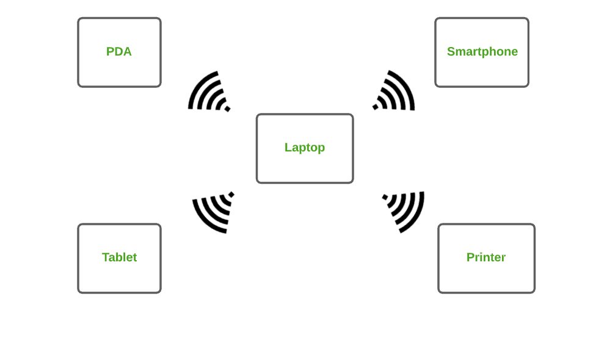
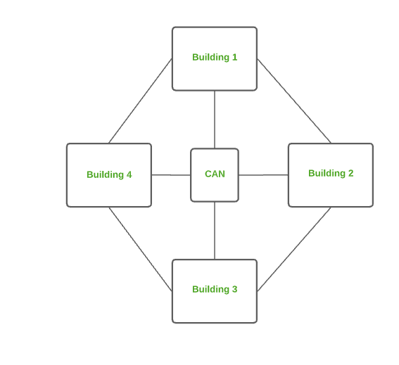
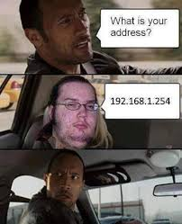
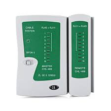
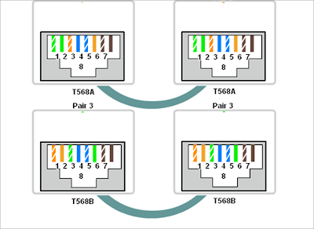

# Crimping & Routing IPv4
## Daftar Isi
- 1 Dasar Jaringan Protokol
    - Kenapa Komputer Harus Terhubung ke Jaringan
    - Jenis-Jenis Jaringan
    - Jaringan Komputer Punya Aturan?
    - Semua Komputer Memiliki Alamat
- 2 Masuk ke IP Address
- 3 Masuk ke IPv4
- 4 Kenektivitas Kabel LAN
    - Crimpring
    - Routing Menggunakan Router
        - Statis
        - Dinamis

## 1 Dasar Jaringan Protokol

Apa Itu Jaringan Komputer? 
Nihh dari gambar di atas Admin jelasin, Spongebob kan tinggal di kompleks rumah bareng Squidward dan Patrick. Nah mereka kan salaing ngobrol, pinjem barang satu sama lain, yang artinya mereka ber-3 itu saling terkoneksi. Nah kids, itu disebut **jaringan.**

Begitupun di sekitar kita, jaringan komputer adalah kumpulan perangkat seperti laptop, PC, printer, router yang terhubung satu sama lain untuk **berbagi informasi dan sumber daya.**

| Perumpamaan Dunia Nyata              | Di Dunia Jaringan Komputer        |
|--------------------------------------|------------------------------------|
| Rumah                                | Komputer                           |
| Jalan antar rumah                    | Kabel jaringan                     |
| Surat yang dikirim antar rumah       | Data yang dikirim antar perangkat  |
| Tukang pos                           | Router                             |
| Ngobrol sama tetangga dekat          | LAN (Local Area Network)           |
| Ngobrol sama tetangga beda kampung   | WAN (Wide Area Network)            |

### 1.1 Kenapa Komputer Harus Terhubung ke Jaringan
Bayangkan kamu ingin mengirim file dari satu komputer ke komputer lain **tanpa jaringan**, kamu harus meng-copy file tersebut ke flashdisk terlebih dahulu. Lalu mencabut dan mencolokkannya ke komputer tujuan. 

Bisa dibayangkan proses manual tersebut memakan waktu dan memiliki keterbatasan jarak. Bahkan risiko kerusakan atau kehilangan data. Namun, dengan pemanfaatan **jaringan** pengiriman file tidak perlu mengandalkan alat eksternal seperti flashdisk. Selain itu pemindahan file dapat dalam hitungan detik dan tanpa kamu berpindah tempat.

Jadi kids koneksi jaringan bukan sebagai kebutuhan tambahan aja, no no no. Karena tanpa jaringan kemampuan komputer menjadi terbatas.

### 1.2 Jenis-Jenis Jaringan

Untuk informasi lebih rinci dapat dilihat di:
[Jenis-Jenis Jaringan](https://www.geeksforgeeks.org/types-of-computer-networks/)

#### 1.2.1 Personal Area Network (PAN)

**PAN** atau *Personal Area Network* ibarat jaringan kecil yang hanya mengelilingi satu orang. PAN ini khusus buat menghubungkan perangkat pribadi kamu yang jaraknya deket-deket, sekitar 1-100 meter.

Contohnya smartphone, laptop, smartwatch, bahkan printer yang kamu pakai sendiri bisa saling terhubung lewat jaringan ini.

**Fungsi PAN pada kehidupan sehari-hari:**
- Transfer file dari HP ke laptop lewat Bluethooh.
- Ngeprint dokumen dari laptop ke printer via USB

PAN ada 2 jenis:
- Wireless PAN: Nggak usah pakai kabel, dalam penerapannya memanfaatkan Bluetooth, WiFi, atau Zigbee. Contohnya kalau kamu lagi dengerin lagu pakai wireless headset dari HP kamu.
- Wired PAN: Pakai kabel, misalnya USB. Contohnya ketika kamu nyambungin HP ke laptop buat ngecas sekaligus sekaligus kirim file.

| ✅ **Kelebihan PAN**                                   | ❌ **Kekurangan PAN**                                                        |
|--------------------------------------------------------|-------------------------------------------------------------------------------|
| Praktis & fleksibel banget buat pemakaian pribadi      | Jangkauannya kecil, cuma buat sekitar 1 orang                                 |
| Biayanya murah dan gampang disetting                   | Kecepatan transfer data bisa terbatas, tergantung teknologinya                |
| Nggak perlu teknisi buat instalasi                     | Kadang perangkat nggak semua kompatibel satu sama lain                        |
| Mudah dibawa kemana-mana alias portable                | Beberapa teknologi PAN (kayak Zigbee) bisa agak mahal                         |
| Cocok buat orang yang pengen simple                    |                                                                       
#### 1.2.2 Local Area Network (LAN)

**LAN** atau *Local Area Network* adalah jenis jaringan komputer yang paling sering dipakai, terutama di tempat-tempat yang areanya terbatas, kayak di rumah, kator, sekolah, atau lab. Jarak jangkauan LAN maksimal 2 km dengan kecepatan transfer yang tinggi.

Jaringan ini menghubungkan **dua atau lebih** komputer dalam satu area lokal, pengaplikasian lewat kabel Ethernet atau Wi-Fi. Jika melalui Ethernet berarti menggunakan kabel LAN dan pengaplikasiannya dicolok ke switch atau router. Kalau pakai Wi-Fi nggak perlu pakek kabel dan pengaplukasiannya tinggal menggunakan hotspot.

Contohnya komputer di lab MIOT yang bisa diakses bersama atau semua komputer kantor yang bisa mengirim file satu sama lain.

| Kelebihan                 | Kekurangan                                                                 |
|-------------------------  |----------------------------------------------------------------------------|
| **Privasi Terjaga:** LAN bersifat privat, jadi tidak diatur oleh badan eksternal tertentu           | **Biaya Awal Lumayan:** Butuh perangkat tambahan seperti switch, router, dan software server      |
| **Kecepatan Tinggi:** Bisa mencapai 100 Mbps atau lebih, cocok buat transfer file besar         | **Privasi Bisa Terganggu:** Admin jaringan bisa akses file pribadi dan history internet kamu          |
| **Banyak Media Transmisi:** Bisa pakai kabel UTP, fiber optic, bahkan Wi-Fi   | **Jangkauan Terbatas:** Hanya berlaku untuk area lokal, tidak cocok untuk area yang terlalu luas                           |
| **Murah & Gampang Dipasang:** Instalasi, perawatan, dan pengembangannya relatif murah & simpel | **Risiko Keamanan Data:** Kalau server utama diretas, semua data di jaringan bisa bocor           |
| **Fleksibel & Scalable:** Bisa ditambah komputer atau perangkat lain dengan mudah     |                     |

#### 1.2.3 Campus Area Network (CAN)

**CAN** atau *Campus Area Network* adalah jaringan komputer yang ukurannya **lebih besar dari LAN**, tetapi masih **lebih kecil dari MAN**. CAN biasanya digunakan di sekolah, kampus, ataupun beberapa gedung dalam satu kompleks. Jarak konektivitas CAN 1 - 5 km.

Jadi bisa kamu bayangkan di TW2 ada lab MIOT, lab Robotik, ruang kelas di lantai 6, dan sekretariat di lantai 2 yang dihubungkan dalam satu jaringan—itulah CAN! Paham Ente ? 👊🏻

Teknologi CAN sama dengan LAN yang menggunakan Ethernet dan jika Wi-Fi.

| ✅ Kelebihan                                                          | ❌ Kekurangan                                                                 |
|-----------------------------------------------------------------------|--------------------------------------------------------------------------------|
| **Kecepatan**: Transfer data antarsistem lebih cepat karena menggunakan LAN, bukan internet umum.      | **Jangkauan Terbatas**: Tidak cocok untuk koneksi antar kota atau wilayah yang sangat luas. |
| **Keamanan**: Admin jaringan bisa mengatur akses dan menjaga jaringan dengan firewall.                | **Butuh Admin Tetap**: Diperlukan admin khusus agar jaringan tetap stabil dan aman.         |
| **Efisien Biaya**: Setup dan perawatan sedang, bisa pakai WiFi untuk menghemat kabel.                | **Bisa Overload**: Jika terlalu banyak pengguna aktif dan tidak diatur dengan baik.           |

#### 1.2.4 Metropolitan Area Network (MAN)

**MAN** atau *Metropolitan Area Network* adalah jaringan komputer yang ukurannya **lebih besar dari CAN**, tapi masih **lebih kecil dari WAN**. Jaringan ini digunakan untuk menghubungkan komputer-komputer dalam satu kota dengan jarak efektivitas 5-50 km.

Teknologi dibalik MAN ada **FDDI** atau *Fiber Distributed Data Interface*, **CDDI** atau *Copper Distributed Data Interface*, **ATM** atau *Asynchronous Transfer Mode*. Kecepatan MAN sekitar 10-100 Mbps.

**Contoh penerapannya:**
- Jaringan antar kampus dalam satu kota.
- Koneksi antar gedung perkontoran pemerintah.
- Sistem tiket atau informasi transportasi kota.
- Jaringan rumah sakit dan klinik dalam area kota.

| ✅ Kelebihan                                           | ❌ Kekurangan                                                                                  |
|--------------------------------------------------------|------------------------------------------------------------------------------------------------|
| **Koneksi Cepat:** Walaupun luas jangkauannya besar, MAN masih bisa memberikan kecepatan 10–100 Mbps.| **Struktur Kompleks:** Desain dan instalasinya cukup rumit, perlu perencanaan dan teknisi ahli.   |
| **Tingkat Keamanan Tinggi:** Lebih aman dibandingkan WAN karena lebih dikontrol dan terbatas.        | **Biaya Mahal:** Karena sering pakai fiber optic dan perangkat mahal, biaya awalnya cukup tinggi. |
| **Transfer Dua Arah (Simultan):** Berkat arsitektur dual bus, bisa kirim data dua arah sekaligus.    | **Toleransi Error Rendah:** Kalau ada masalah di satu titik jaringan, bisa berpengaruh besar.     |
| **Mendukung Banyak Pengguna Sekaligus:** Cocok untuk institusi besar yang butuh koneksi cepat bareng.| **Transfer Data Bisa Lebih Lambat dari LAN:** Karena jangkauannya lebih luas, kecepatannya bisa turun. |
| **Manajemen Terpusat:** Jaringan bisa dipantau dan dikendalikan dengan mudah dari satu pusat kontrol.|                                                                                                |

#### 1.2.5 Wide Area Network (WAN)

**WAN** atau *Wide Area Network* adalah jaringan komputer yang punya jangkauan paling luas dibandingkan jenis jaringan lainnya seperti LAN dan MAN. 

Kalau LAN untuk satu ruangan, MAN untuk satu kota, nahh WAN ini bisa antar kota, negara, bahkan benua. Jarak jangkauan WAn bisa lebih dari 50 km. Sungkem dulu ente sama WAN 😏

Seorang WAN ini bentuk paling umum dan pasti kalian tau adalah internet itu sendiri!

Proses kerja WAN biasanaya dengan menghubungkan jaringan kecil seperti LAN lalu melewati jalur komunikasi bersama seperti *leased line*, Dial-up, dan VPN.

**Contoh Penggunaan WAN:**
- Internet yang kamu gunakan sehari-hari.
- Perusahaan multinasional yang menghubungkan kantor pusat dengan cabang di berbagai negara.
- Kampus atau lembaga pendidikan yang berbagi data dan akses server antar lokasi.

| Kelebihan                                     | Kekurangan                                                                     |
|-----------------------------------------------|--------------------------------------------------------------------------------|
| **Jangkauan Sangat Luas:** Cocok untuk perusahaan yang punya banyak cabang di lokasi berbeda.         | **Kemacetan Lalu Lintas Data:** Karena skalanya besar, sering terjadi trafik padat yang bikin lambat. |
| **Akses Data Terpusat:** Semua data bisa disimpan di satu server pusat dan bisa diakses dari mana saja.| **Toleransi Kesalahan Rendah:** Kalau satu titik terganggu, bisa berdampak ke seluruh jaringan.        |
| **Hemat Biaya Perjalanan:** Gak perlu kirim orang, cukup hubungkan sistem lewat WAN.                  | **Banyak Gangguan & Error:** Karena banyak titik koneksi, potensi error lebih tinggi.                  |
| **Terhubung ke Dunia:** WAN memungkinkan komunikasi & bisnis di level global.                         | **Kecepatan Rendah Dibanding LAN:** Semakin jauh & ramai, makin lambat transfer datanya.               |

### 1.3 Jaringan Komputer Punya Aturan??

Untuk informasi lebih rinci dapat dilihat di:
([Jenis-Jenis Jaringan](https://www.geeksforgeeks.org/types-of-computer-networks/))

Dalam dunia jaringan komputer, **protokol** adalah aturan main yang mengatur bagaimana perangkat bisa berkomunikasi satu sama lain. Tanpa protokol, perangkat seperti laptop, server, atau router nggak akan paham "bahasa" satu sama lain, meskipun sudah terhubung ke jaringan.

#### **Jenis-Jenis Protokol:**
#### 1.3.1 Protokol Komunikasi (*Communication Protocols*)
Protokol yang mengatur **cara pertukaran data antar perangkat**. Mereka memastikan data dikirim dan diterima dengan format dan cara yang benar.

##### 1.3.1.1 Hypertext Transfer Protocol (HTTP)

**HTTP** atau *Hypertext Transfer Protocol* adalah bahasa standar yang dipakai untuk mengakses webside di internet seperti Chrome, Firefox, Safari.

HTTP dapan merespon halaman web, gambar, video atau file lain. HTTP bersifat *stateless*, artinya setiap permintaan HTTP dianggap sebagai transaksi yang terpisah. Contohnya kamu *klik* dua *link* berbeda di satu web, server akan mengganggap bahwa kamu adalah dua *user* yang berbeda.

**Metode HTTP**
HTTP punya berbagai metode permintaan sesuai dengan fungsinya:
| Metode  | Fungsi                                                             |
|---------|--------------------------------------------------------------------|
| GET     | Mengambil data dari server (contohnya buka halaman web)            |
| POST    | Mengirim data ke server (misalnya isi formulir login)              |
| PUT     | Mengupdate data yang sudah ada                                     |
| DELETE  | Menghapus data dari server                                         |

**Kode Status HTTP**

Server akan merespon dengan memberikan kode status untuk memberitahu hasilnya. Contoh yang paling umum:
| Kode | Arti                                      |
|------|-------------------------------------------|
| 200  | Berhasil (OK)                             |
| 404  | Halaman tidak ditemukan (Not Found)       |
| 500  | Kesalahan dari sisi server                |

##### 1.3.1.2 Hypertext Transfer Protocol Secure (HTTPS)

**HTTPS** atau *Hypertext Transfer Protocol Secure* merupakan versi lebih aman dari HTTP. Bedanya, HTTP itu kayak ngobrol di tempat umum, semua orang bisa dengerin. Sementara HTTPS itu kayak ngobrol di ruang tertutup dan dienkripsi–cuma kamu dan server yang tahu isi pembicaraannya.

HTTPS menambahkan lapisan keaman dengan menggunakan protokol enkripsi seperti:
- SSL (*Secure Socket Layer*)
- TLS (*Transport Layer Security*)
Jadi kalau pakai enkripsi tadi data-data kayak login, password,info kartu kredit itu nggak bisa dibaca sama pihak ketiga. Bahkan kalaupun disadap, datanya akan kelihatan acak dan nggak bisa dibaca tanpa kunci dekripsi.

Jadi kalau ada pilihan HTTP atau HTTPS pilih yang ada 

##### 1.3.1.3 File Transfer Protocol (FTP)

**FTP** atau *File Transfer Protocol* adalah protokol standar yang digunakan untuk mengirim dan menerima file antar komputer melalui jaringan. FTP digunakan saat ingin meng-upload file server atau download file dari server.

FTP menggunakan mode **client & server**, yang artinya client (user) akan menghubungi  server (komputer tujuan) untuk meminta atau mengirim file.

**FTP punya 2 mode koneksi:**
1. Active Mode: Client terhubung ke server lewat port 21 dan server akan membuka port lain untuk kirim data.
2. Passive Mode: Cocok untuk client ada di balik *firewall* atau *router NAT*. Server akan membuka port acak untuk melakukan transfer data, lalu client akan ber-inisiatif mengkoneksi ke port itu.

##### 1.3.1.4 Transmission Control Protocol (TCP)

**TCP** atau *Transmission Control Protocol* adalah salah satu protokol utama di lapisan transport dalam jaringan komputer. Nahh. TCP ini punya tugas untuk memastikan bahwa data yang dikirim dari satu perangkat ke perangkat lain sampai dengan urutan yang benar, lengkap, dan tanpa rusak.

Sebelum mengirim data TCP salalu buat janji dulu nih, jadi TCP akan buat koneksi dulu antara pengirim dan penerima, biasanya dikenal dengan istilah **three-way handshake** kayak gini:
1. SYN: Pengirim bilang "Aku mau kirim data"
2. SYN - ACK: Penerima jawab "Ok, aku siap"
3. ACK: Pengirim konfirmasi "Sip, kirim dimulai"
Nah baru setelah itu, datanya dikirim.

TCP punya kelebihan komunikasi dua arah alias **full duplex**. Artinyee, saat kamu kirim data, kamu juga bisa menerima data dari lawan bicara secara bersamaan. Contohnyaa waktu kamu video call atau chat. Selain itu TCP bisa melakukan pengecekan error, retransmisi kalau ada data rusak atau hilang, dan pengaturan urutan data agar file atau informasi samapei degnan urutan yang benar

Port number TCP untuk menunjukan apliikasi atau layangan tertentu di perangkat, misalnya:
1. Port 80: Untuk HTTP
2. Port 443: Untuk HTTPS
3. Port 25: Untuk email (SMTP)

##### 1.3.1.5 Internet Protocol (IP)
 

**IP** atau *Internet Protocol* adalah tulang punggung dari internet. Kalau TCP adalah kang kurur pakek data yang hati-hati, IP ini GPS-nya yang menentukan ke mana pakek data itu pergi.

Setiap perangkat yang terhubung ke jaringan **pasti** punya alamat IP, alamat ini dipakai untuk mengenali dan menemukan perangkat tersebut di jaringan. Ada 2 jenis IP address:

| Jenis IP | Contoh Format                      | Keterangan                                   |
|----------|------------------------------------|----------------------------------------------|
| IPv4     | 192.168.0.1                        | Umum digunakan, 32-bit (angka desimal)       |
| IPv6     | 2001:0db8:85a3::8a2e:0370:7334     | Versi baru, 128-bit (angka heksadesimal)     |

Cara IP Bekerja:

1. IP memecah data menjadi paket-pakek kecil sebelum dikirim
2. Tiap paket diberi alamat asal dan tujuan
3. Router dan switch di jaringan akan membaca alamat IP lalu meneruskan pakek ke jalur yang benar
IP juga bisa membantu menemukan jalur tercepat dan efisien supaya pakek datang lebih cepat

Berbeda ngan TCP yang perlu buat "janji" dulu, IP itu **connectionless** artinya, nggak perlu buat koneksi dulu buat ngirim data, tiap pakek data dikirim secara independen. Nah contohnya kamu mau ngirim 5 pakek niih dengan ekspedisi yang berbeda-beda, selama asal alamatnya benar, semua pakeknya pasti sampek.

Nah di IP sendiri ada komponen yang penting yaitu **router dan switch** yang fungsinya sebagai navigator IP. Jadi mereka berdua bisa baca alamat IP tujuan, menentukan rute tercepat, dan ngirim paket ke jalur yang tepat.

#### 1.3.2 Protokol Keamanan (*Security Protocols*)
Protokol komunikasi memastikan **data bisa dikirim**, protokol keamanan memastikan **data itu aman**. Mereka mencegah data dibajak, dibaca orang iseng, atau dimodifikasi saat dikirim.

#### 1.3.3 Protokol Manajemen (*Management Protocols*)
Protokol ini dipakai untuk **mengatur** dan **memantau** perangkat dalam jaringan. Biasanya dipakai oleh admin jaringan untuk memastikan semua perangkat berjalan normal.

##### 1.3.3.1 Dynamic Host Configuration Protocol (DHCP)
 

**DHCP** atau *Dynamic Host Configuration Protocol* memiliki peran yang sangat penting untuk IP otomatis. Jadi, kalau kamu pernah nyambung ke Wi-Fi dan langsung bisa internetan tanpa atur IP secara maunal, itu hasil kerjanya DHCP. Selain itu DHCP juga mengatur **subnet mask, default gateway, DNS server**

Secara sederhana proses kerja DHCP dibagi menjadi 4 langkah:
| Tahap           | Penjelasan                                                                      |
|---------------- |-----------------------------------------------------------------------------    |
| 1. Discover     | Perangkat baru bergabung ke jaringan dan “teriak”: “Ada yang bisa kasih IP?”    |
| 2. Offer        | Server DHCP (biasanya router) jawab: “Nih, aku punya IP kosong buat kamu.”      |
| 3. Request      | Perangkat bilang: “Oke, aku mau pakai IP yang kamu tawarkan.”                   |
| 4. Acknowledge  | Server jawab lagi: “Siap, IP itu sekarang resmi kamu pakai.”                    |

### 1.4 Semua Komputer memiliki Alamat 
Alamat apa nih? Misalkan rumahmu punyua nomor dan temanmu mau ke rumahmu jadi kamu kasih tau nomor rumahnya. Konsep jaringan komputer juga sama.

Identitas Komputer itu disebut IP Address

Kalau alamat komputer itu ada dua: make address dan IP address

## 2 IP Address?
Pasti kalian sudah sering dengar IP address ini atau misalkan sering lihat angka ini 192.168.1.1 namun kalian masih bingung kegunaannya sama pentingnya bagi kita itu apa.

IP Address (Internet Protocol Address) adalah alamat identitas unik yang dimiliki setiap perangkat yang terhubung ke jaringan. 
IP Address itu bisa kita ibaratkan seperti alamat rumah di dunia internet. Tapi bukannya “Jl. Mawar No. 5”, alamat ini berbentuk deretan angka-angka yang dipisahkan titik. 
Contohnya kayak gini: 192.158.1.38.

 

Terus alamat rumah kan ditentuin, kalau alamat perangkat kita siapa yang kasih??
IP Address nggak muncul secara acak, ya! IP itu sebenarnya dibuat secara matematis dan dibagikan secara resmi oleh lembaga bernama:
🔹 **IANA (Internet Assigned Numbers Authority)**
IANA ini adalah bagian dari ICANN, yaitu:
🔹 **ICANN (Internet Corporation for Assigned Names and Numbers)**

Sebuah organisasi nirlaba yang lahir di Amerika tahun 1998, dan tugasnya menjaga keamanan dan keteraturan internet di seluruh dunia — biar semua perangkat bisa saling terhubung dengan benar.

### 2.1 Gimana Cara Kerja IP Address?
IP Address itu kayak **bahasa komunikasi universal** yang dipakai semua perangkat buat ngobrol satu sama lain di internet. Gak peduli kamu pakai HP, laptop, atau kulkas pintar, semua saling "ngobrol" pakai aturan komunikasi yang sama: Internet Protocol (IP).

 

Jadi kalau misalkan kehidupan manusia bahasa internasionalnya itu bahasa inggris, nah di dunia komputer bahasa komunikasi mereka itu IP.

Prosesnya Emang Gimana?
1. Perangkatmu nyambung ke jaringan (kayak Wi-Fi rumah, kantor, atau kafe).
2. Jaringan itu terhubung ke internet lewat ISP (Internet Service Provider).
3. ISP akan ngasih IP Address ke perangkatmu, supaya bisa "dikenali" di internet.
4. Saat kamu browsing, ISP-lah yang nganterin data ke internet dan ngembaliin data ke kamu pakai alamat IP tadi.

### 2.2 Jenis-Jenis IP Address
Misalkan gini, anggota keluarga di rumah kalian pasti ada panggilannya kan? "Ayah", "Ibu", "Kakak", "Adik" dan mereka bisa saling berkomunikasi satu sama lain namun jika ada orang dari luar komplek ingin kirim surat ke "Ayah" misalnya, pasti surat itu tidak dikirim langsung ke "Ayah" pasti melalui Alamat Rumah Kalian.

Nah, dengan pengandaian begitu IP Address ini memiliki dua jenis utama:

#### 2.2.1 🏠 Private IP Address
Ini kayak nama panggilan antar anggota keluarga.
Setiap perangkat di jaringan rumah/kantor kamu (HP, laptop, printer, TV pintar, bahkan mesin kopi pintar 😄) dapat alamat unik dari router supaya:

Bisa dikenali satu sama lain

Nggak tabrakan saat kirim data

Contoh alamat privat:
**192.168.0.5**, **10.0.0.12**, **172.16.1.3**

Jadi, meskipun semua rumah pakai nama “Ayah”, “Ibu”, “Adik”, mereka tetap aman karena masing-masing beroperasi di rumahnya sendiri.

#### 2.2.2 🌍 Public IP Address
Ini alamat utama yang dikenal orang luar.
Kalau teman kamu kirim paket, dia gak kirim ke “Kamar Kakak” tapi ke **alamat rumahmu**, 
misalnya: **103.94.189.35**

Alamat ini diberikan oleh ISP (Internet Service Provider) kamu ke router, supaya jaringanmu bisa:

- Terhubung ke internet
- Dikenali dari luar

Jadi walaupun ada banyak perangkat di rumahmu, semuanya tetap keluar ke internet lewat satu pintu — alias satu public IP address.

🔑 Analogi Singkat:
|Dunia Nyata            |	Dunia Jaringan          | 
|-----------------------|---------------------------|
|Alamat Rumah           |	Public IP Address       |
|Nama Anggota di Rumah  |	Private IP Address      |
|RT/RW                  |	Jaringan Lokal (LAN)    |
|POS/Kurir              |	ISP                     |

### 2.3 IP Adress Dinamis
Secara singkat ialah IP yang bisa berubah-ubah secara otomatis. Bayangin kamu ngontrak kos dan setiap beberapa bulan kamu pindah kamar. Nomor kamarmu berubah, tapi kamu tetap bisa tinggal di kos yang sama. Nah, begitu juga dengan **IP Dinamis**.

#### 2.3.1  Ciri-ciri IP Dinamis:

1. Diberikan oleh ISP (Internet Service Provider) secara otomatis.

2. Sering berubah dalam waktu tertentu.

3. Dikelola pakai **sistem DHCP (Dynamic Host Configuration Protocol)**.

4. IP ini dipinjam dari "kolam IP besar" yang dimiliki oleh ISP.

5. Setelah kamu mati nyalakan modem/router, bisa jadi IP kamu berubah.

#### 2.3.2 Kapan harus pakai IP Dinamis??
**🔄 "Kalau bisa ngekos, ngapain beli rumah?"**

**IP Dinamis** itu cocok untuk kondisi-kondisi di mana alamat IP tidak perlu tetap dan bisa berubah-ubah tanpa masalah. IP dinamis ini juga yang paling sering kita gunakan sehari hari karena ada di laptop, hp, komputer, dan lain lain.

Jika ingin lebih detail lagi :
Penggunaan sehari-hari di rumah
-  Kamu cuma pakai internet buat browsing, streaming, meeting, game, dll.
-  Kamu nggak perlu akses jarak jauh ke perangkatmu.
-  Cukup terima apa yang diberikan modem secara otomatis? IP dinamis jawabannya.

Banyak perangkat yang sering ganti-ganti koneksi
- Misalnya WiFi publik, kantor, atau kampus.
- Setiap hari pengguna berganti, jadi sistem akan otomatis kasih IP baru.

Nggak mau ribet setting IP manual
- IP akan dikasih otomatis dari router via DHCP, tinggal nyambung aja, langsung bisa internetan.

Keamanan lebih fleksibel
- Karena alamat IP sering berubah, hacker akan kesulitan menarget perangkat tertentu secara terus-menerus.

### 2.4 IP Adress Statis

Intinya IP yang selamnya tidak berubah kecuali kamu ubah secara manual, jadi IP statis ini seperti rumah milik pribadi. Nomor rumahmu nggak akan berubah, dan orang bisa dengan mudah menemukanmu. Berbeda dengan IP dinamis (yang bisa berubah-ubah tiap nyambung), **IP statis** ditetapkan secara manual oleh administrator jaringan atau oleh penyedia layanan internet (ISP), dan tidak diubah secara otomatis oleh DHCP.

#### 2.4.1 Ciri-ciri IP Statis
📌 Ciri-ciri IP Statis:

1. Ditetapkan secara permanen ke satu perangkat/jaringan.

2. Biasanya dibutuhkan oleh server, CCTV, hosting, atau layanan email sendiri.

3. Mudah dilacak dan diakses dari internet karena alamatnya selalu sama.

#### 2.4.2 Kapan Harus Pakai IP Statis??
**🧱 "Kalau kamu mau bikin rumah di maps, jangan pindah-pindah dong!"**

IP Statis cocok untuk perangkat atau sistem yang harus bisa diakses dari luar jaringan secara konsisten. Misalnya server, kamera, atau printer jaringan.

Jika lebih ingin detail sekali lagi:
Perangkat harus bisa diakses jarak jauh
- Contoh: Server web, file server, remote desktop, CCTV.
- Kalau IP-nya berubah, user di luar jaringan akan kehilangan akses. Jadi harus tetap.

Perlu konfigurasi jaringan yang stabil
- Misalnya mau bikin subnetting, firewall rules, VPN.
- Alamat IP yang tetap bikin pengaturan jadi lebih mudah dan bisa diprediksi.

Mempermudah troubleshooting
- IP statis bikin teknisi jaringan gampang melacak masalah.
- Nggak perlu nebak-nebak, IP si printer atau server pasti segitu terus.

Membuat identitas jaringan tetap dikenal
- Misalnya domain diarahkan ke IP tertentu (contoh: website kampus = 103.xxx.xxx.xxx).
- Kalau IP-nya gonta-ganti, domainnya jadi error.

### 2.5 IP Dinamis vs IP Statis
|Tujuan / Kondisi                         |	Pakai IP Dinamis ✅     |	Pakai IP Statis ✅|
|-----------------------------------------|-------------------------|-----------------------|
|Akses internet harian biasa              |          ✔️             |                       |
|Perangkat sering ganti pengguna          |            ✔️           |                       |
|Bisa diakses dari luar (server, CCTV)    |                         |            ✔️         |    
|Stabil & tetap (tidak berubah-ubah)      |                         |           ✔️          |
|Konfigurasi otomatis (plug & play)       |            ✔️          |                        |
|Konfigurasi manual, butuh kontrol penuh  |                         |              ✔️       |

Perbedaan Singkat
|Fitur          |	Dynamic IP                  |	Static IP                       |
|---------------|-------------------------------|-----------------------------------|
|Sifat Alamat   |	Berubah-ubah                |	Tetap / permanen                |
|Ditetapkan oleh|	ISP secara otomatis (DHCP)  |	Secara manual / oleh admin ISP  |
|Cocok untuk    |	Pengguna rumahan, umum      |	Server, hosting, bisnis         |
|Biaya          |	Lebih hemat	                |   Bisa lebih mahal                |
|Keamanan       |	Lebih susah dilacak         |	Lebih rentan jika tidak aman    |
|Koneksi Remote |	Kurang ideal                |	Ideal untuk akses dari luar     |

## 3 IPv4
**Apa itu IPv4?** – "Alamat Rumahmu di Dunia Internet"
Merupakan versi IP yang paling umum digunakan saat ini (walau sudah ada IPv6). IPv4 sudah dipakai sejak zaman ARPANET tahun 1983 – nenek moyangnya internet modern. IPv4 adalah versi ke-4 dari internet protokol. Bisa dibilang, ini adalah cara komputer saling sapa dan kirim paket di dunia maya, kayak kurir antar barang ke alamat yang tepat.

IP Address versi IPv4 menggunakan angka **32-bit** yang dibagi menjadi empat kelompok angka, berarti tiap kelompok angka itu akan memiliki 1 oktet atau 8 bit -> 2^8 = 256, sehingga tiap angkanya bisa dari 0 sampai 255. Jadi rentang IP yang mungkin itu dari 0.0.0.0 sampai 255.255.255.255. Banyak banget, kan? Tapi tetap teratur, bukan acak.

### 3.1 Struktur IPv4
Karena 32-bit tadi dibagi 4, maka IPv4 ini memiliki **4 Oktet (4 blok angka)**.
Contoh : **192.168.0.10**
|Oktet  |	Angka   |	Binari (8-bit)  |
|-------|-----------|-------------------|
|1      |	192     |	11000000        |
|2      |	168     |	10101000        |
|3      |	0       |	00000000        |
|4      |	10      |	00001010        |

IPv4 berbentuk seperti ini sama seperti kamu menyusun alamat:
Oktet 1–3 bisa menunjukkan lokasi jaringan

Oktet 4 bisa menunjukkan alamat perangkat di jaringan itu

Karena IPv4 memiliki 32 bit -> sehingga total kombinasi alamat yang dimiliki ialah 2^32 = 4.294.967.296 alamat.

Artinya, IPv4 bisa membuat lebih dari 4 miliar alamat unik. Tapi karena ada alamat-alamat yang dipesan khusus (reserved), tidak semuanya bisa dipakai publik.

''

### 3.2 Representasi Biner IPv4
**“Komputer nggak ngerti angka desimal kayak 192.168.1.1. Dia cuma ngerti 0 dan 1!”**

Setiap alamat IPv4 sebenarnya terdiri dari 32 bit. Tapi supaya mudah dibaca manusia, alamat IP dibagi jadi empat bagian (oktet) dan ditulis dalam desimal (contoh: 185.107.80.231).

🔄 Contoh Konversi ke Biner
Alamat IP: 185.107.80.231

|Oktet  |	Desimal |	Biner   |
|-------|-----------|-----------|
|1      |	185     |	10111001|
|2      |	107     |	01101011|
|3      |	80      |	01010000|
|4      |	231     |	11100111|

➡️ Jadi alamat 185.107.80.231 kalau dibaca oleh komputer:
10111001.01101011.01010000.11100111

### 3.3  Struktur Alamat IPv4
**“Anggap aja alamat IP itu seperti alamat rumah: ada nama komplek, nomor rumah, dan blok.”**

IPv4 terdiri dari 3 bagian utama:

1. **Network Part**
Menunjukkan jaringan utama tempat host berada.

Semua perangkat di jaringan yang sama punya bagian ini identik.

Bisa dianggap seperti nama komplek perumahan.

2. **Host Part**
Identitas unik setiap perangkat (komputer, HP, printer, dsb) di dalam jaringan.

Harus berbeda untuk tiap perangkat.

Ibaratnya seperti nomor rumah.

3. **Subnet Part (Opsional)**
Digunakan untuk membagi jaringan besar menjadi beberapa bagian kecil (subnet).

Mirip kayak blok perumahan dalam satu komplek supaya lebih tertata.

### 3.4 Pembagian Kelas IPv4

#### 3.4.1 Class A – Untuk Jaringan Raksasa
**"Class A itu seperti kota besar dengan jalan utama super lebar, cocok buat banyak kendaraan (host)!"**

- Siapa yang pakai? Organisasi besar seperti perusahaan multinasional, institusi pemerintah, atau penyedia layanan internet (ISP) besar.

- Kenapa istimewa? Karena hanya memakai 1 oktet pertama untuk network ID, sisanya 3 oktet untuk host.

- Artinya, 1 jaringan Class A bisa punya lebih dari 16 juta perangkat di dalamnya. Gila kan? Tapi karena ini super gede, cuma ada 126 jaringan Class A yang tersedia (dari 1.0.0.0 s/d 126.255.255.255).

- IP 127.x.x.x bukan Class A biasa, melainkan khusus untuk loopback (buat test jaringan sendiri).

🔒 Private IP Class A
Private IP-nya adalah dari 10.0.0.0 hingga 10.255.255.255

Biasanya dipakai oleh perusahaan besar yang punya banyak divisi atau cabang, tapi semua tetap di dalam satu jaringan internal.

#### 3.4.2 Class B – Jaringan Menengah ke Atas
**"Class B itu seperti kota sedang dengan jalan dua arah – cukup luas buat perusahaan gede, tapi nggak segede Class A."**

- Cocok buat siapa? Universitas, rumah sakit besar, perusahaan dengan beberapa lokasi.

- Di Class B, 2 oktet pertama untuk network ID, sisanya 2 oktet untuk host.

- Satu jaringan Class B bisa punya sekitar 65 ribu perangkat. Sudah cukup buat banyak kantor!

- Alamat IP-nya mulai dari 128.0.0.0 hingga 191.255.255.255.

🔒 Private IP Class B
Private IP-nya adalah dari 172.16.0.0 hingga 172.31.255.255

Sering dipakai buat jaringan skala menengah yang tetap butuh kontrol internal.

#### 3.4.3 Class C – Untuk Jaringan Kecil
**"Class C itu kayak komplek perumahan. Jalurnya kecil tapi cukup buat rumah-rumah (host) yang nggak terlalu banyak."**

- Cocok untuk siapa? Bisnis kecil, sekolah, warnet, atau jaringan rumah.

- Menggunakan 3 oktet pertama sebagai network ID, hanya 1 oktet terakhir untuk host.

- Setiap jaringan Class C bisa menampung 254 host saja (karena 2 alamat dipakai buat network dan broadcast).

- IP-nya mulai dari 192.0.0.0 hingga 223.255.255.255.

🔒 Private IP Class C
Private IP-nya adalah dari 192.168.0.0 hingga 192.168.255.255

Ini yang paling sering kita temui di rumah atau kantor kecil.

#### 3.4.4 Class D – Multicast, Bukan Buat Host!
**"Class D itu kayak siaran TV digital – satu pemancar bisa disaksikan banyak orang sekaligus!"**

- Class D tidak digunakan untuk mengidentifikasi perangkat individual.

- Digunakan untuk multicast, yaitu pengiriman data ke banyak perangkat sekaligus, seperti:

- Streaming video/audio

- Live conference

- Update data ke banyak node secara bersamaan

- IP-nya mulai dari 224.0.0.0 hingga 239.255.255.255

Sayangnya tidak bisa dipakai sebagai IP normal seperti Class A, B, atau C.

#### 3.4.5 Class E – Penelitian dan Masa Depan
**"Class E itu seperti lahan kosong yang disiapkan buat eksperimen ilmuwan."**

- Class E tidak digunakan dalam jaringan umum.

- Dicadangkan untuk eksperimen, riset, dan keperluan khusus.

- IP-nya mulai dari 240.0.0.0 hingga 255.255.255.255

- Sama seperti Class D, tidak boleh digunakan oleh perangkat biasa.

### 3.5 Prefix dan Subnet Mask IPv4
Dalam pembahasan IPv4, kita tahu bahwa sebuah alamat IP terdiri dari 32 bit angka biner, yang dibagi menjadi dua bagian penting:

Network ID: Menunjukkan jaringan tempat komputer itu berada.

Host ID: Menunjukkan perangkat (komputer, printer, dll.) di dalam jaringan tersebut.

Tapi... gimana cara kita tahu berapa banyak bit yang digunakan untuk Network ID dan sisanya untuk Host ID?

Nah, di sinilah prefix berperan.

#### 3.5.1 Fungsi Prfix
Prefix adalah angka yang menunjukkan berapa banyak bit pertama dari alamat IP yang digunakan untuk Network ID. Biasanya ditulis setelah tanda garis miring /.

Contoh Penulisan Prefix:
192.168.3.0/24

- Angka /24 disebut prefix.

- Artinya, 24 bit pertama dari alamat IP tersebut adalah bagian Network ID.

- Sisa 8 bit digunakan untuk Host ID (karena total ada 32 bit).

##### 3.5.1.1 Prefix Emang Penting??
Tanpa prefix, kita tidak bisa tahu bagian mana dari alamat IP yang menunjukkan jaringan dan bagian mana yang menunjukkan perangkat di dalam jaringan.

Dengan prefix, kita bisa:

- Menentukan jumlah host yang bisa digunakan di dalam jaringan.

- Membagi jaringan besar menjadi beberapa jaringan kecil (subnet).

- Melakukan konfigurasi routing dengan benar, terutama pada router.

##### 3.5.1.1 Cara Membaca Prefix
**➤ Contoh 1**: 192.168.3.0/24
IP Address dalam biner:
11000000.10101000.00000011.00000000

Prefix /24 berarti 24 bit pertama adalah untuk Network ID:

Network ID: 192.168.3

Host ID: 0 sampai 255

Tapi host hanya bisa digunakan dari 1 sampai 254 karena:

192.168.3.0 → network address

192.168.3.255 → broadcast address

Maka total host yang bisa digunakan adalah 254.
---------------------------------------------------
**➤ Contoh 2**: 192.168.3.130/29
Prefix /29 berarti 29 bit pertama adalah Network ID.

Sisa bit: 32 - 29 = 3 bit untuk Host ID.

3 bit bisa menghasilkan 2³ = 8 kombinasi, tapi:

1 untuk network address

1 untuk broadcast address

Maka host yang bisa digunakan hanya 6 IP address saja.

#### 3.5.2 Aoa itu Subnet Mask??
**Subnet mask** adalah angka biner 32-bit yang digunakan untuk membagi jaringan IP menjadi beberapa bagian yang lebih kecil yang disebut subnet. Proses pembagian ini disebut subnetting, dan fungsinya adalah untuk mengelola dan **mengoptimalkan penggunaan alamat IP** dalam suatu jaringan.

Jika sebuah jaringan terlalu besar dan mencakup terlalu banyak perangkat (host), maka akan sulit untuk mengatur lalu lintas data. Di sinilah subnetting berguna. Dengan memecah jaringan besar menjadi jaringan-jaringan kecil, lalu lintas data bisa dikendalikan lebih baik, dan keamanan serta efisiensinya meningkat.

Subnet mask bekerja bersama dengan IP address untuk menunjukkan bagian mana dari IP tersebut yang merupakan network ID (identitas jaringan) dan bagian mana yang merupakan host ID (identitas perangkat di jaringan itu). Ini penting untuk mengetahui apakah dua perangkat berada di jaringan yang sama atau tidak.

Contoh sederhana:
|IP Address |192.168.1.10   |
|-----------|---------------|
|Subnet Mask|255.255.255.0  |

Dengan subnet mask tersebut, kita tahu bahwa **192.168.1** adalah **bagian network**, dan **.10 adalah bagian host**.

##### 3.5.2.1 Fungsi Subnet Mask
Subnet mask tidak hanya berguna untuk membagi jaringan menjadi subnet, tetapi juga memiliki beberapa fungsi penting lainnya:

1. **Memisahkan Network dan Host ID**
Subnet mask membantu sistem dan perangkat jaringan untuk mengetahui mana bagian dari alamat IP yang menunjuk ke jaringan, dan mana yang menunjuk ke perangkat. Tanpa subnet mask, komputer tidak tahu ke mana data harus dikirim.

2. **Mengurangi Kemacetan Jaringan (Kongesti)**
Dengan membagi jaringan besar menjadi bagian-bagian kecil, maka jumlah host yang saling “berebut” jalur komunikasi bisa dikurangi. Ini memperlancar lalu lintas data dan meningkatkan performa jaringan secara keseluruhan.

3. **Meningkatkan Keamanan Jaringan**
Dengan subnetting, jaringan bisa dipecah untuk memisahkan perangkat-perangkat tertentu. Misalnya, perangkat penting bisa dipisahkan dari perangkat umum, sehingga mengurangi risiko akses ilegal atau serangan jaringan.

4. **Penghematan Alamat IP**
Subnetting membuat penggunaan alamat IP lebih efisien. Tanpa subnetting, alamat IP bisa cepat habis karena banyak yang tidak digunakan secara optimal. Dengan pembagian subnet yang cermat, alokasi IP bisa disesuaikan dengan kebutuhan sebenarnya.

5. **Memudahkan Administrasi Jaringan**
Ketika jaringan sudah terlalu besar, pengelolaan akan lebih sulit. Subnetting mempermudah pemantauan, pengaturan, dan troubleshooting jaringan karena setiap bagian bisa ditangani secara terpisah.

#### 3.5.3 Hubungan Subnet Mask dengan Prefix

Prefix dan subnet mask adalah dua cara berbeda untuk menjelaskan hal yang sama: **berapa banyak bit dari sebuah alamat IP yang digunakan untuk Network ID**.

- **Prefix** ditulis dalam format garis miring, misalnya `/24`
- **Subnet mask** ditulis dalam format desimal bertitik, misalnya `255.255.255.0`

Keduanya saling berkaitan dan bisa dikonversi satu sama lain.

🔁 Konversi Prefix ke Subnet Mask

| Prefix | Subnet Mask         | Jumlah Bit Host | Jumlah Host yang Bisa Dipakai |
|--------|---------------------|------------------|-------------------------------|
| /8     | 255.0.0.0           | 24               | 16.777.214 host               |
| /16    | 255.255.0.0         | 16               | 65.534 host                   |
| /24    | 255.255.255.0       | 8                | 254 host                      |
| /25    | 255.255.255.128     | 7                | 126 host                      |
| /26    | 255.255.255.192     | 6                | 62 host                       |
| /27    | 255.255.255.224     | 5                | 30 host                       |
| /28    | 255.255.255.240     | 4                | 14 host                       |
| /29    | 255.255.255.248     | 3                | 6 host                        |
| /30    | 255.255.255.252     | 2                | 2 host                        |
| /31    | 255.255.255.254     | 1                | 0 host (khusus point-to-point) |
| /32    | 255.255.255.255     | 0                | 0 host (identifikasi satu perangkat saja) |

Rumus Menghitung Jumlah Host: 2^(32 - Prefix) - 2

- **32**: Total bit dalam IPv4
- **-2**: Dikurangi Network Address dan Broadcast Address

---

Contoh Perhitungan:

**Contoh:** 192.168.3.130/29  
- Prefix: `/29` → 32 - 29 = 3 bit untuk host  
- Jumlah host = 2³ - 2 = **6 host yang bisa digunakan**

**Subnet Mask-nya:**  
- 29 bit = 255.255.255.248

> ✅ Kesimpulan:
Prefix dan subnet mask adalah dua cara untuk menentukan berapa banyak perangkat yang bisa dipasang di suatu jaringan. Dengan memahami konversinya, kita bisa mengatur jaringan secara efisien dan optimal.

## 4 KONEKTIVITAS KABEL LAN
### 4.1 CRIMPING 
Dalam jaringan komputer, komunikasi antara satu perangkat dengan perangkat lainnya membutuhkan suatu media. Walaupun sudah ada teknologi *wireless*, kegunaan kabel internet masih dibutuhkan dan belum tergantikan. Jadi kidss, buat praktikum ini kalian akan belajar secara langsung bagaimana cara menyusun kabel dengan urutan yang benar menggunakan alat *crimping*.

#### 4.1.1 Peralatan yang Digunakan
Untuk belajar *crimping* kita butuh peralatan ini kidss:
1. Kabel UTP (*Unshielded Twisted Pair*) 
 

Kabel UTP atau biasanya disebut kabel internet sama mbak-mbak Berkat ini dari fisik bisa dilihat kalau beda sama kabel biasanya. Disatu selongsong kabel utama ada kumpulan kabel lain yang punya kode warna yang beda-beda.

| Pin | Warna Kabel       | Fungsi                                       |
|-----|-------------------|-------------------------------------         |
| 1   | Putih-Oranye      | Transmit Data (+)                            |
| 2   | Oranye            | Transmit Data (–)                            |
| 3   | Putih-Hijau       | Receive Data (+)                             |
| 4   | Biru              | Tidak digunakan (dulu: telepon)              |
| 5   | Putih-Biru        | Tidak digunakan (dulu: telepon)              |
| 6   | Hijau             | Receive Data (–)                             |
| 7   | Putih-Coklat      | Tidak digunakan (untuk PoE/jaringan gigabit) |
| 8   | Coklat            | Tidak digunakan (untuk PoE/jaringan gigabit) |

2. RJ45 

Fungsi dari RJ45 adalah sebagai konektor yang menghubungkan kabel UTP dengan perangakat.

3. Tang Crimping 

Tang jenis ini khusus digunakan untuk memasang RJ45 pada kabel UTP.

4. LAN Tester 

Alat ini digunakan untuk mengecek tiap kabel sudah benar terhubung atau tidak.

#### 4.1.2 Konfigurasi Kabel LAN
Ada beberapa macam konfigurasi kabel LAN berdasarkan urutan warnanya, menurut standar internasional dibagi menjadi **T568A** dan **T568B** 

Sedangkan dari pemasangannya dibagi menjaadi 2:
1. **Straight-Through**
Jenis pengkabelan ini digunakan untuk menyambungkan **dua tipe perangkat berbeda** yang tersambung ke jaringan, yakni perangkat DTE (data terminal equipment) ke DCE (data circuit-terminating equipment) atau sebaliknya. Perangkat DTE adalah perangkat yang melakukan generate data digital dan bertindak sebagai source dan destination untuk data digital, contohnya adalah komputer, mikrokomputer, terminal, printer. DCE adalah perangkat yang menerima dan mengkonversi data ke link telekomunikasi yang sesuai, umumnya DCE adalah perangkat jaringan seperti router, switch, modem. 

Nah di*Straight-Through* punya aturan pemasangan, tiap ujung kabel harus punya urutan warna yang sama. Misal ujing yang satu menggunakan aturan warna T568A, ujung yang satunya berarti juga harus ikut aturan T568A.

2. **Crossover**
Berkebalikan dengan kabel Straight-through, pengkabelan ini digunakan untuk menyambungkan **dua tipe perangkat yang sama** yang tersambung ke jaringan, yakni perangkat DTE ke DTE atau DCE ke DCE. Misalnya antara komputer dengan komputer, router dengan router, router dengan switch, komputer dengan printer. 

Aturan pemasangannya pun berbeda dengan kabel jenis straight-trough, kabel jenis Crossover memiliki urutan warna yang berbeda dikedua ujungnya. Tapi, perbedaan warna ini tidak boleh sembarangan, karena kedua ujung ini juga memiliki aturan urutan warna. Pada kabel jenis Crossover standar, jika salah satu ujung Pin memiliki susunan warna berdasarkan aturan T568A, maka ujung Pin yang lain harus memiliki urutan warna berdasarkan standar T568B.

#### Video Tutorial
Tontong kids, udah dibikinin nih 🤬 
[ini link tutorial]

### 4.2 ROUTING PAKE ROUTER 

#### 4.2.1 STATIS 

#### 4.2.2 DINAMIS

## Referensi
1.2 [Jenis-Jenis Jaringan](https://www.geeksforgeeks.org/types-of-computer-networks/) 
1.3 [Jenis-Jenis Protokol Komunikasi](https://www.geeksforgeeks.org/types-of-computer-networks/)