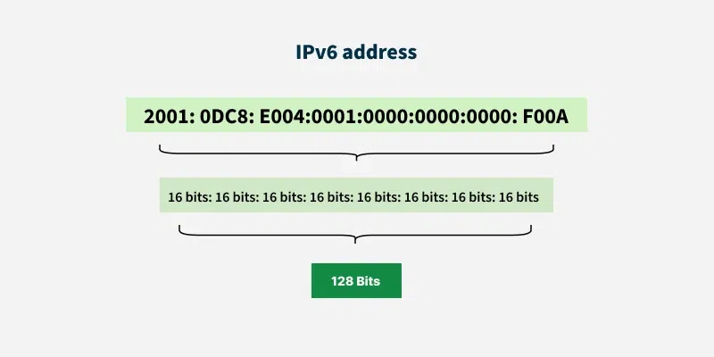
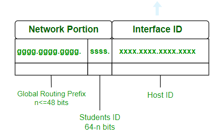
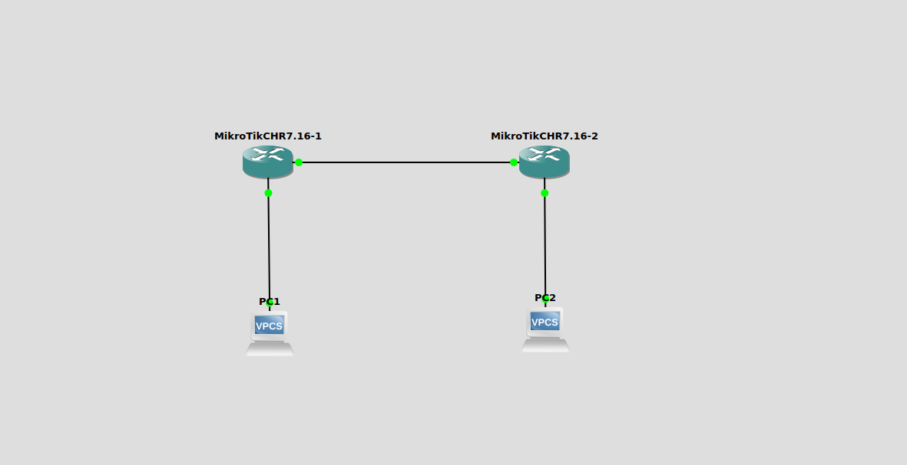
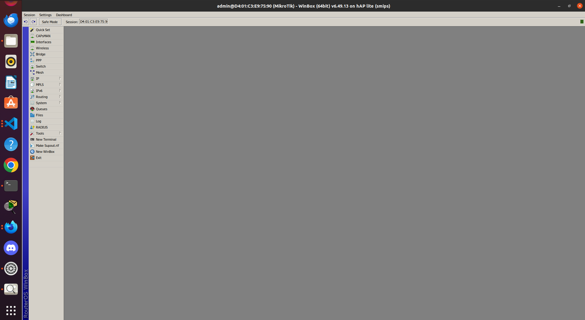
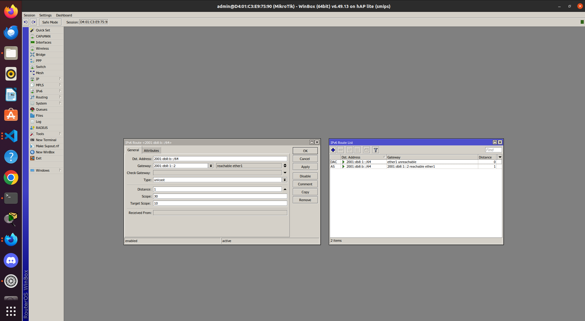
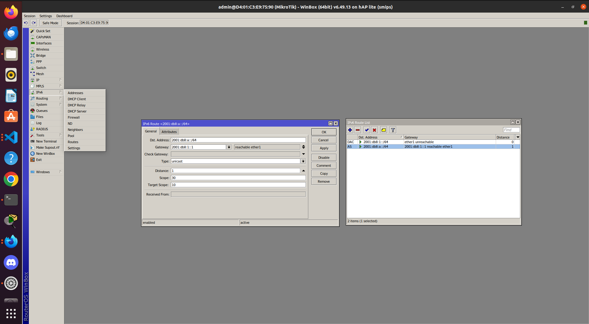
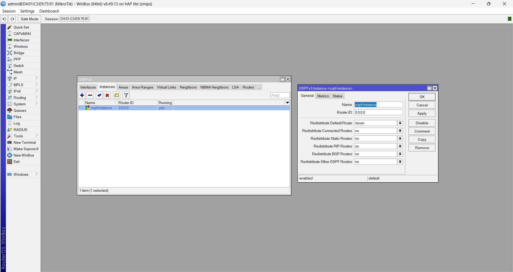
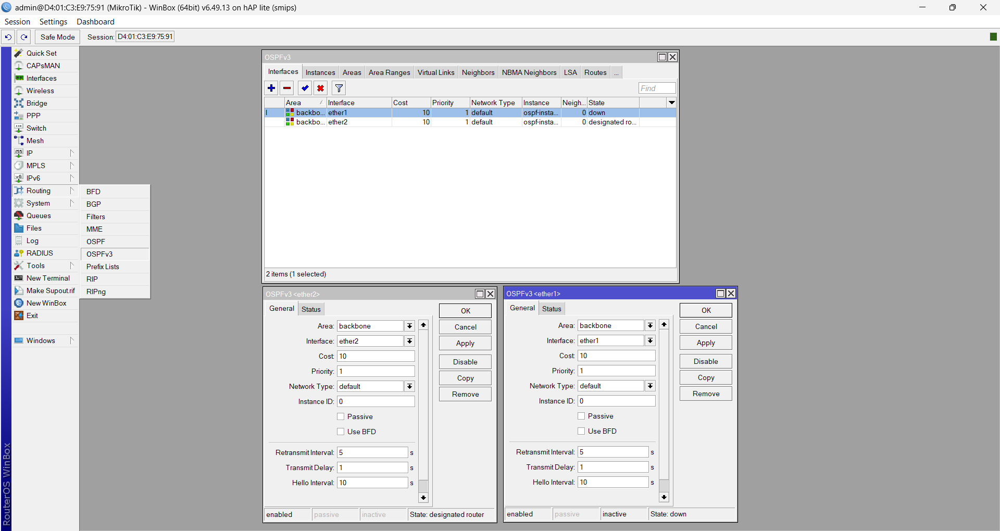

# 📚 Daftar Isi
- [Tugas Pendahuluan](#tugas-pendahuluan)
- [Modul](#modul-routing-&-manajemen-ipv6)
- [Tugas Modul](#tugas-modul)
- [Referensi](#referensi)

# Tugas Pendahuluan

1. Jelaskan apa itu IPV6 dan apa bedanya dengan IPV4.
2. Sebuah organisasi mendapatkan blok alamat IPv6 2001:db8::/32.
    a. Bagilah alamat tersebut menjadi empat subnet berbeda menggunakan prefix /64.
    b. Tuliskan hasil alokasi alamat IPv6 subnet untuk:
        - Subnet A
        - Subnet B
        - Subnet C
        - Subnet D
3. Asumsikan terdapat sebuah router yang menghubungkan keempat subnet tersebut melalui empat antarmuka:
- ether1 (Subnet A)
- ether2 (Subnet B)
- ether3 (Subnet C)
- ether4 (Subnet D)
a. Tentukan alamat IPv6 yang akan digunakan pada masing-masing antarmuka router.
b. Buatkan konfigurasi IP address IPv6 pada masing-masing antarmuka router.
4. Buatlah daftar IP Table berupa daftar rute statis agar semua subnet dapat saling berkomunikasi.
5. Jelaskan apa fungsi dari routing statis pada jaringan IPv6, dan kapan sebaiknya digunakan dibandingkan routing dinamis.


# Modul Routing & Manajemen IPv6
## ❓ 1 Apa itu IPv6


IPv6 atau Internet Protocol version 6 adalah generasi terbaru dari alamat IP. Nahh, IPv6 ini bisa ngasih jumlah alamat yang jauuuuh lebih banyak dibandingkan IPv4. Jumlah alamat IPv4 sekitar 4 miliar alamat, sedangkan IPv6 dia bisa nyediain 2 pangkat 128 alamat IP ngasih sampai 340 *undecilion* alamat! 340 + 36 nol dibelakangnya.

Format alamat IPv6 itu kayak gini:<br>

<br>
Setiap "x" adalah angka heksadesimal (angka 0–9 dan huruf a–f), mewakili 4 bit. Nah, kalau ada nol di depan, bisa diskip biar lebih singkat. Misalnya 0042 bisa ditulis jadi 42. Terus, kalau ada banyak nol berurutan, bisa diganti ::, tapi cuma boleh sekali pakai dalam satu alamat.

Soal penerapannya, sekarang banyak perangkat udah mulai pakai Dual-IP Stack, artinya bisa jalanin IPv4 dan IPv6 sekaligus. Tapi kalau bisa, perangkat bakal lebih milih IPv6 duluan. Biasanya perusahaan-perusahaan gede mulai aktifin IPv6 dari router utama di jaringan luar (WAN), terus ke router di perbatasan, firewall, data center, sampai akhirnya ke router yang ngatur koneksi desktop.

## 📡 2 IPv4 v.s. IPv6
| Fitur                           | IPv6                                               | IPv4                                      |
| ------------------------------- | -------------------------------------------------- | ----------------------------------------- |
| *Panjang Alamat*              | 128-bit                                            | 32-bit                                    |
| *Konfigurasi Alamat*          | Mendukung konfigurasi otomatis & penomoran ulang   | Mendukung konfigurasi manual dan via DHCP |
| *Jumlah Alamat yang Tersedia* | Sangat besar: 3.4 × 10³⁸ alamat                    | Sekitar 4.29 × 10⁹ alamat                 |
| *Format Alamat*               | Ditulis dalam format heksadesimal                  | Ditulis dalam format desimal              |
| *Checksum*                    | Tidak tersedia di IPv6                             | Tersedia di IPv4                          |
| *Ukuran Header*               | Ukuran tetap 40 byte                               | Ukuran bervariasi antara 20-60 byte       |
| *Dukungan VLSM*               | Tidak mendukung VLSM (Variable Length Subnet Mask) | Mendukung VLSM                            |

## ❓ 3 Kemana IPv5?
Nah, lucunya… IPv5 itu sebenarnya nggak pernah benar-benar ada! 🤯
Meskipun angka “5” udah pernah dipakai sebagai versi protokol IP, versi IP yang resmi dikenal cuma ada IPv4 dan IPv6.

Yang disebut-sebut sebagai IPv5 itu sebenernya adalah Internet Stream Protocol (ST) — bukan pengganti IPv4, bukan juga pendahulu IPv6.

*Ceritanya gimana?*
1. Tahun 1979, seorang peneliti bernama James W. Forgie ngusulin protokol ini lewat dokumen eksperimen internet (IEN 119).

2. Tahun 1990, protokol ini dikembangkan jadi ST2 (Stream Protocol versi 2) lewat dokumen resmi RFC 1190.

3. Tujuan utamanya? Buat mengirim suara dan video lewat jaringan internet (kayak video call zaman sekarang).

4. Tapi… baik ST maupun ST2 nggak pernah dipakai secara luas. Semuanya masih tahap eksperimen aja.

*Jadi Kenapa Dikasih Nomor 5?*
Karena ST butuh cara buat ngebedain header-nya dari IPv4, akhirnya angka “5” dipakai sebagai tanda versinya di dalam paket data. Tapi ini bukan versi IP resmi. Gara-gara itu, biar nggak bingung, versi setelah IPv4 langsung loncat ke IPv6.

*Kok Nggak Jadi IPv5 Beneran?*
Masalah utama di IPv4 adalah jumlah alamat IP-nya cuma 4,29 miliar (karena 32-bit). Nah, ST/“IPv5” juga cuma bisa ngasih jumlah alamat segitu — artinya nggak nyelesain masalah kehabisan IP.

Padahal saat itu, kebutuhan akan alamat IP udah makin gila-gilaan. Bayangin aja, tahun 2025 diprediksi ada:
- 5+ miliar pengguna internet
- 27+ miliar perangkat IoT

Jadi, bikin “IPv5” yang kemampuannya sama kayak IPv4 itu ibarat tambal ban bocor pake permen karet — nggak tahan lama!!

Makanya, akhirnya diputuskan buat langsung loncat ke IPv6 yang bisa nyediain alamat IP hampir tak terbatas.

## 📦 4 Kunggulan dan Kekurangan IPv6
| ⚙ Aspek                             | ✅ Kelebihan IPv6                                                                       | ❌ Kekurangan IPv6                                                            |
| ------------------------------------ | -------------------------------------------------------------------------------------- | ---------------------------------------------------------------------------- |
| 🔢 Alamat IP                         | Ruang alamat *sangat luas* (128-bit, bisa tampung 340 triliun triliun alamat)        | Belum semua perangkat dan sistem dukung IPv6 secara penuh                    |
| 🔗 NAT (Network Address Translation) | *Tidak butuh NAT*, langsung pakai global address                                     | Transisi dari NAT IPv4 ke non-NAT IPv6 butuh penyesuaian arsitektur jaringan |
| 🚀 Kecepatan                         | Umumnya *lebih cepat* dari IPv4 karena tidak pakai NAT dan struktur header sederhana | Beberapa jaringan IPv6 masih terbatas dan tergantung implementasi ISP        |
| 🔐 Keamanan                          | Sudah *mendukung IPsec secara bawaan*, lebih aman dan siap untuk enkripsi end-to-end | Masih rentan jika implementasi IPsec tidak diatur dengan benar               |
| 🔍 Pemindaian alamat                 | *Sangat sulit dipindai* oleh attacker karena jumlah alamat yang sangat banyak        | Jika attacker tahu pola, pemindaian masih bisa dilakukan (meski lebih sulit) |
| 🔒 Fitur keamanan ekstra             | Mendukung *SEND (Secure Neighbor Discovery)*, untuk validasi identitas perangkat     | Belum semua perangkat dukung atau implementasikan SEND                       |
| 🛠 Konfigurasi alamat               | Mendukung *SLAAC (Stateless Address Auto Configuration)* otomatis, tanpa DHCP        | Beberapa administrator lebih familiar dengan DHCP dari IPv4                  |
| 📦 Header paket                      | Header tetap 40 byte → *lebih ringan diproses*, tidak ada checksum yang memperlambat | Tidak ada checksum → keamanan data sepenuhnya bergantung pada layer lain     |
| 📡 Routing                           | Routing lebih efisien, *tidak terjadi fragmentasi paket di router*                   | Butuh update pada perangkat router lama agar dukung IPv6                     |
| 🌍 Adopsi global                     | Solusi jangka panjang untuk kebutuhan internet global dan IoT                          | Masih banyak ISP dan organisasi yang belum migrasi penuh ke IPv6             |

## Cara Menghitung Prefix IPv6

## Topologi Praktikum



## Enable IPV6 pada Router Mikrotik
1. Reset Router Jika masih ada konfigurasi 
Pastikan router telah di-reset ke kondisi awal (tanpa konfigurasi) agar konfigurasi yang kita lakukan bersih dan tidak terjadi konflik, Untuk reset bisa gunakan winbox masuk menu system->reset konfigurasi-> cek list no default konfigurasi

2. Login ke Router
Gunakan Winbox untuk mengakses router melalui MAC address atau IP default. Login menggunakan user admin (tanpa password jika belum diatur).

2. Enable IPV6
Masuk pada menu System->Package, lalu anda akan menemukan IPV6 jika itu belum aktif maka klik ipv6 lalu tekan tombol enable.

2. Restart Router
Jika sudah enable package IPV6 maka silangkan reboot router anda menggunakan menu system->.


# Troubleshooting
1. Jika sudah konek dengan router atau terkendala PING antar PC Pastikan masing-masing laptop firewall nya sudah di masikan yang berada di setting semua di matikan.
2. Jika IPV6 belum ada di Router maka harus di Enable dulu dengan masuk ke Winbox menu System->Packages, lalu pilih IPV6 dan tekan Enable, Jika sudah Enable maka anda tinggal reboot router dengan ke menu System->Reboot.

Setelah Reboot jika package sudah ter install maka menu IPV6 akan muncul


## Routing Statis IPv6


Langkah-langkah menghubungkan 2 Router dengan Routing Statis Di Mikrotik :

Konfigurasi Router
1. Reset Router Jika masih ada konfigurasi 
Pastikan router telah di-reset ke kondisi awal (tanpa konfigurasi) agar konfigurasi yang kita lakukan bersih dan tidak terjadi konflik, Untuk reset bisa gunakan winbox masuk menu system->reset konfigurasi-> cek list no default konfigurasi

2. Login ke Router
Gunakan Winbox untuk mengakses router melalui MAC address atau IP default. Login menggunakan user admin (tanpa password jika belum diatur).

3. Konfigurasi IP Address pada Ether1 (note lakukan konfigurasi ini pada router A dan B)
Tambahkan IP address pada ether1 yang digunakan sebagai jalur antar-router. Karena hanya ada dua perangkat yang terhubung (router A dan router B),<br>
- IP ether1 Router A  : 2001:db8:1::1/64
- IP ether 1 Router B : 2001:db8:1::2/64
4. Konfigurasi IP Address untuk Jaringan LAN (note lakukan konfigurasi ini pada router A dan b)
Tambahkan IP address pada ether 2 yang digunakan untuk menghubungkan Laptop dengan Router. <br>
- IP ether 2 Router A  : 2001:db8:a::1/64
- IP ether 2 Router B  : 2001:db8:b::1/64


<br>

Catatan Jika pada Konfigurasi IPV6 di Address terdapat IPV6 dengan code DL ketika belum add IP ke interface tenang IP tersebut jangan di hapus tetapi di biarkan saja karena itu adalah IPV6 Link Local dari Router Mikrotik yang tergenerate otomatis.<br>


5. Konfigurasi Routing Statis (note lakukan konfigurasi ini pada router A dan b)
Setelah semua interface diberi IP, langkah selanjutnya adalah menambahkan rute secara manual.
Masuk ke menu IPv6 → Routes, kemudian klik "+" untuk menambahkan routing.
Pada Router 1
- Dst. Address: 2001:db8:b::/64
- Gateway: 2001:db8:1::2
Pada Router 2
- Dst. Address: 2001:db8:a::/64
- Gateway: 2001:db8:1::1





6. Test Koneksi Antar Router
- Dari Router1, buka New Terminal, ping LAN Router2:
```bash
ping 2001:db8:b::1
```
- Dari Router2, ping LAN Router1:
```bash
ping 2001:db8:a::1
```
6. Konfigurasi IP Adress di Laptop (note lakukan konfigurasi ini laptop yang terhubung pada router A dan b masing-masing)
Karena ini masih menggunakan konfigurasi Static IP tambahkan IP address secara manual ke interface di laptop masing-masing bisa lewat Control Panel atau langsung di settings Windows, pastikan IP dan Gateway sudah benar sesuai Ether 2.
Pada laptop yang terhubung ke Router 1
- IP Address: 2001:db8:a::100
- Prefix    : /64
- Gateway   : 2001:db8:a::1 (Router1)
-DNS        :2001:4860:4860::8888
Pada laptop yang terhubung ke Router 2
- IP Address: 2001:db8:b::100
- Prefix    : /64
- Gateway   : 2001:db8:b::1 (Router2)
- DNS       : 2001:4860:4860::8888


7. Jika Sudah Uji test PING dari Laptop 1 ke alamat Laptop 2, Jika berhasil maka Routing tidak ada masalah.

Pada konfigurasikan Router 2 dan laptop yang terhubung ke router 2 lakukan hal yang sama


## Routing Dimanis IPv6


Langkah-langkah menghubungkan 2 Router dengan Routing Statis Di Mikrotik :

Konfigurasi Router
1. Reset Router Jika masih ada konfigurasi 
Pastikan router telah di-reset ke kondisi awal (tanpa konfigurasi) agar konfigurasi yang kita lakukan bersih dan tidak terjadi konflik, Untuk reset bisa gunakan winbox masuk menu system->reset konfigurasi-> cek list no default konfigurasi

2. Login ke Router
Gunakan Winbox untuk mengakses router melalui MAC address atau IP default. Login menggunakan user admin (tanpa password jika belum diatur).

3. Konfigurasi IP Address pada Ether1 (note lakukan konfigurasi ini pada router A dan b)
Tambahkan IP address pada ether1 yang digunakan sebagai jalur antar-router. Karena hanya ada dua perangkat yang terhubung (router A dan router B),<br>
- IP ether1 Router A  : 2001:db8:1::1/64
- IP ether 1 Router B : 2001:db8:1::2/64
4. Konfigurasi IP Address untuk Jaringan LAN (note lakukan konfigurasi ini pada router A dan b)
Tambahkan IP address pada ether 2 yang digunakan untuk menghubungkan Laptop dengan Router. <br>
- IP ether 2 Router A  : 2001:db8:a::1/64
- IP ether 2 Router B  : 2001:db8:b::1/64


5. Konfigurasi Routing Dinamis (note lakukan konfigurasi ini pada router A dan b) 
Setelah semua interface diberi IP, langkah selanjutnya adalah menggunakan OSPFv3 untuk Routing Dinamis.
1. Buat Instance OSPFv3 
- Masuk ke menu IIPv6 > Routing > OSPFv3 > Instances → Klik + untuk menambahkan routing.
- Name: ospf-instance
- Router ID: misalnya 0.0.0.0 untuk Router1, 0.0.0.0 untuk Router2

2. Tambah Area
- Masuk ke menu Routing > OSPFv3 > Areas → Klik +
- Name: backbone
- Instance: pilih ospf-instance
- Area ID: 0.0.0.0 (wajib untuk backbone area)

3. Tambah Interface OSPFv3
- Router1:
- Masuk ke menu Routing > OSPFv3 > Interface → Klik +
- Interface: ether1 (ke Router2)
- Instance: ospf-instance
- Area: backbone
Tambahkan juga interface LAN:
- Interface: ether2
Router2:
- Tambahkan interface ether1 dan ether2 dengan cara yang sama

4. Cek Neighbor & Routing
Masuk ke menu Routing > OSPFv3 > Neighbors
- Harus muncul tetangga OSPF antara Router1 dan Router2
Optional coba cek Masuk ke menu IPv6 > Routes
- Harus terlihat rute dinamis ke jaringan 2001:db8:a::/64 dan 2001:db8:b::/64
5. Dari Router1 terminal, coba ping LAN di Router2:
```bash
ping 2001:db8:b::1
```
6. Konfigurasi IP Adress di Laptop (note lakukan konfigurasi ini laptop yang terhubung pada router A dan b masing-masing)
Karena ini masih menggunakan konfigurasi Static IP tambahkan IP address secara manual ke interface di laptop masing-masing bisa lewat Control Panel atau langsung di settings Windows, pastikan IP dan Gateway sudah benar sesuai Ether 2.
Pada laptop yang terhubung ke Router 1
- IP Address: 2001:db8:a::100
- Prefix    : /64
- Gateway   : 2001:db8:a::1 (Router1)
- DNS       : 2001:4860:4860::8888
Pada laptop yang terhubung ke Router 2
- IP Address: 2001:db8:b::100
- Prefix    : /64
- Gateway   : 2001:db8:b::1 (Router2)
- DNS       : 2001:4860:4860::8888


7. Jika Sudah Uji test PING dari Laptop 1 ke alamat Laptop 2, Jika berhasil maka Routing tidak ada masalah.

Pada konfigurasikan Router 2 dan laptop yang terhubung ke router 2 lakukan hal yang sama

# Tugas Modul
1. Simulasikan Konfigurasi Praktikum P2 di atas mengenai Routing Dinamis dan Statis IPV6 menggunakan GNS3
# Referensi
## 1 [Apa itu IPv6](https://www.thousandeyes.com/learning/techtorials/ipv4-vs-ipv6)
## 1 [Apa itu IPv6](https://www.geeksforgeeks.org/what-is-ipv6/)
## 2 [IPv4 v.s. IPv6](https://www.geeksforgeeks.org/what-is-ipv6/)
## 3 [Kemana IPv5?](https://www.ipxo.com/blog/what-happened-to-ipv5/)
## 3 [Kemana IPv5?](https://www.cloudns.net/blog/ipv4-vs-ipv6-internet-protocol/)
## 4 [Video Installasi GNS3]() --dalam proses
## 5 [Video Contoh Konfigurasi di GNS3]() --dalam proses